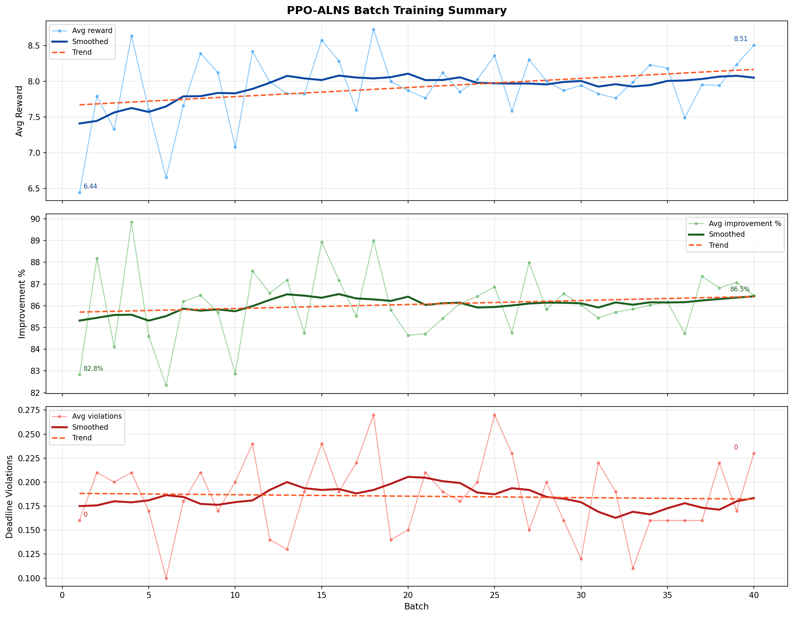

# VahanSetu — Smart Reverse Auction Logistics Platform

**A Smart Reverse Auction Logistics Platform**  
National Institute of Technology Patna · Department of Computer Science and Engineering  
Minor Project · March 2026

> **Status:** ML/optimization core complete. Full platform (frontend, backend, auction engine) is under active development.

---

## Overview

VahanSetu is an intelligent logistics platform where customers post shipment requests and transporters competitively bid to fulfill them through a reverse auction mechanism. The platform uses machine learning for route optimization and price prediction, real-time WebSocket communication for live bidding, and an escrow-based payment system for secure transactions.

### Three-Service Architecture

```
/client       → React frontend
/server       → Node.js + Express backend
/ml-service   → FastAPI + PPO-ALNS Python microservice
```

---

## Platform Workflow

1. **Customer** posts a shipment (pickup, delivery, time window, weight, documents)
2. **XGBoost** predicts auction base price; customer pays 10% token deposit into escrow
3. **NPI Algorithm** filters eligible transporters by spatial and temporal proximity
4. **PPO-ALNS** ranks filtered transporters by minimum detour distance and time
5. **Auction opens** — top transporters receive broadcast invitation and bid below base price
6. **Composite scoring** evaluates bids on price, rating, performance history, and aging boost
7. **Winner** receives optimized route; payment released in milestones via Razorpay

---

## Algorithms

### PPO-ALNS for PDVRPTW

Based on Wang et al. (2025), *Journal of Combinatorial Optimization* 50:35.  
Extended from VRPTW to PDVRPTW — each order has both a pickup and delivery location, pickup must precede delivery, and separate time windows apply to both.

**Architecture:**
- **Warm start** — OR-Tools pre-solver generates a feasible initial solution; falls back to time-window sorted greedy insertion if no cache exists
- **ALNS loop** — destroy/repair operators modify the route; Simulated Annealing decides acceptance
- **PPO agent** — a 3-layer MLP (512 → 256 → 128) observes a 17-dimensional state vector and selects one of 15 destroy-repair operator pairs

**Operators:**

| Type | Operators |
|---|---|
| Destroy | Random, Worst-Cost, Shaw, String, Route-Segment |
| Repair | Greedy, Criticality-Based, Regret-2 |

**Cost function:**
```
c(x) = 1.0 × T_travel + 25.0 × L_lateness + 0.05 × E_carbon + 0.1 × F_fuel
     + 1e5 × (capacity violations)
```

**Reward function:**
```
R_t = γ × (c*_before − c_new) / max(c*_before, 1)   if global best improved
    = α × (c_prev − c_new) / c_init                  if local improvement
    = −β × |c_prev − c_new| / c_init                 otherwise
```
with α=1.0, β=1.0, γ=2.5, clipped to [−10, 10]

**Hyperparameters:**

| Parameter | Value |
|---|---|
| net_arch | [512, 256, 128] |
| learning_rate | 3 × 10⁻⁴ |
| n_steps | 128 |
| batch_size | 16 |
| γ (discount) | 0.99 |
| λ (GAE) | 0.95 |
| ent_coef | 0.01 |
| T_max per episode | 50 |
| SA T_start / T_end | 500 / 5 |

### XGBoost Price Predictor

Predicts auction base price and per-transporter breakeven price using:
- 100 sequential decision trees, max depth 4
- Learning rate 0.05, 80% subsample per round
- Early stopping after 30 rounds without improvement
- **R² > 0.95** on test set
- Key features: distance, vehicle type, fuel efficiency, weight, volume, time window, weather, area type

### Node Proximity Index (NPI)

A spatiotemporal filtering algorithm that shortlists transporters by intersecting vehicles passing through source and destination districts within the shipment time window — before applying the heavier PPO-ALNS optimization.

### Composite Bid Scoring

```
Score = [0.70 × Price + 0.20 × Rating + 0.10 × Performance] × (1 + AgingBoost)
```

Aging boost prevents transporter starvation — transporters who consistently lose due to rating gap receive a progressive score boost.

---

## Tech Stack

**Frontend**
- React (Vite), Tailwind CSS
- Socket.io-client (real-time bid updates)
- react-leaflet + Leaflet.js (route maps, OpenStreetMap)
- React Router, Axios

**Backend**
- Node.js + Express, MongoDB + Mongoose
- JWT (role-based auth: customer / transporter)
- Socket.io (WebSocket auction rooms per shipment)
- Razorpay (payments with HMAC-SHA256 verification)
- Multer (shipment document uploads)

**ML Microservice**
- FastAPI + Uvicorn
- PPO-ALNS PDVRPTW model (NumPy, CPU)
- OR-Tools (warm-start cache)
- XGBoost, Stable-Baselines3, Gymnasium

---

## Dataset

300 PDVRPTW instances across the Delhi NCR region, covering order sizes from 3 to 25 per instance. Built from scratch — existing VRPTW benchmarks are incompatible with the pickup-delivery constraint structure required here.

Each instance includes:
- `instances/INST{id}_N{orders}_{zone}.json` — order details, time windows, vehicle specs
- `matrices/INST{id}_distance_km.csv` — real distance matrix (km)
- `matrices/INST{id}_time_min.csv` — real travel time matrix (minutes)

Instance naming: `N{n}` = number of orders, zone suffix `N/W/S` = Delhi NCR zone (North/West/South).

---

## Project Structure

```
vahansetu-ml/
├── src/
│   ├── alns_env.py          # Gymnasium environment — PPO training loop, reward, state
│   ├── alns_operators.py    # Destroy and repair operators
│   ├── constraints.py       # Feasibility checks, route metrics, schedule formatter
│   ├── constants.py         # Single source of truth for cost weights
│   ├── data_loader.py       # Dataset loading, vehicle augmentation
│   ├── main.py              # Demo runner — greedy ALNS vs PPO-ALNS
│   ├── train.py             # Batch PPO training with logging
│   ├── benchmark.py         # 25-run greedy vs PPO comparison
│   ├── presolve.py          # OR-Tools warm-start cache generator
│   └── visualizer.py        # Route plots, cost breakdown charts
│
├── data/
│   └── dataset_v3/
│       ├── instances/       # 300 JSON instance files
│       └── matrices/        # 600 CSV distance/time matrices
│
├── notebooks/
│   ├── BasePrice_xgBoost.ipynb
│   └── batch_summary.png    # PPO-ALNS training results
│
├── .gitignore
├── requirements.txt
└── README.md
```

---

## Results

PPO-ALNS training shows consistent improvement across batches:



XGBoost price predictor achieves R² > 0.95 on the test set. Top feature importances: `distance_km` (0.39), `vehicle_type` (0.31), `fuel_efficiency` (0.10).

---

## Setup (ML Core)

**Requirements:** Python 3.10+

```bash
git clone https://github.com/Asad-Alim/vahansetu-ml.git
cd vahansetu-ml
pip install -r requirements.txt
```

**Generate OR-Tools warm-start cache (optional but recommended):**
```bash
python src/presolve.py --data_dir data/dataset_v3 --cache_dir data/or_cache
```

**Run demo (greedy ALNS baseline):**
```bash
python src/main.py --data_dir data/dataset_v3
```

**Run with trained PPO model:**
```bash
python src/main.py --data_dir data/dataset_v3 --use_ppo --model_path models/ppo_alns_final
```

**Train from scratch:**
```bash
python src/train.py --data_dir data/dataset_v3 --batches 50 --minutes_per_batch 30
```

**Run benchmark (greedy vs PPO, 25 runs):**
```bash
python src/benchmark.py --data_dir data/dataset_v3 --runs 25
```

---

## Team

| Name | Roll No. |
|---|---|
| Shubham Kumar | 2306217 |
| Asad Alim | 2306222 |
| Priyanshu Kumar | 2306227 |

Supervised by **Dr. Antriksh Goswami**, Assistant Professor, CSE, NIT Patna.

---

## Reference

Wang et al. (2025). *Reinforcement Learning Guided Adaptive Large Neighborhood Search for Vehicle Routing Problem with Time Windows*. Journal of Combinatorial Optimization, 50:35.  
